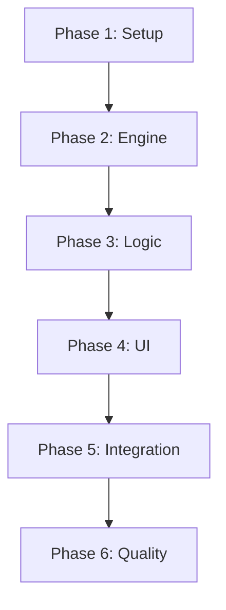

# Implementierungsplan: PhotoSorter C++

## 1. Plan Overview
- **Total Phases**: 6
- **Agents Involved**: 8
- **Estimated Effort**: High (Complex I/O and external library integrations)

## 2. Dependency Graph

## 3. Execution Strategy Table

| Phase | Objective | Agent | Mode | Risk |
|-------|-----------|-------|------|------|
| 1 | CMake & Dependencies | DevOps-Ingenieur | Sequential | LOW |
| 2 | Metadata & Scanning | Kern-Entwickler | Sequential | MEDIUM |
| 3 | Sorting & Verification | Sicherheits-Experte | Sequential | HIGH |
| 4 | ImGui Desktop UI | Integrations-Lead | Sequential | MEDIUM |
| 5 | Multithreading & Metrics| Performance-Experte | Sequential | MEDIUM |
| 6 | Testing & Docs | Qualitätssicherung | Sequential | LOW |

---

## 4. Phase Details

### Phase 1: Project Setup & Infrastructure
- **Objective**: Establish the build system and integrate all third-party libraries using vcpkg.
- **Agent**: DevOps-Ingenieur
- **Files to Create**:
    - `CMakeLists.txt`: Project configuration and dependency linking.
    - `vcpkg.json`: Manifest for `exiv2`, `ffmpeg`, `imgui`, `implot`, `nlohmann-json`, `stb`, `xxhash`.
    - `src/main.cpp`: Basic application entry point.
- **Validation**: `cmake --build build` completes without errors.
- **Blocked by**: None
- **Blocks**: Phase 2

### Phase 2: Core Domain - Analysis Engine
- **Objective**: Implement the scanning and metadata extraction logic.
- **Agent**: Kern-Entwickler
- **Files to Create**:
    - `src/engine/Scanner.hpp/cpp`: Recursive file discovery with sidecar pairing.
    - `src/engine/MediaAnalyzer.hpp/cpp`: EXIF and video metadata extraction (Exiv2/FFmpeg).
    - `src/engine/Types.hpp`: Shared data structures for media metadata and tasks.
- **Validation**: Unit tests for scanner and analyzer verify correct metadata extraction for sample files.
- **Blocked by**: Phase 1
- **Blocks**: Phase 3

### Phase 3: Business Logic - Sorting & Validation
- **Objective**: Implement the core sorting logic and the "No-Loss Policy" verifier.
- **Agent**: Sicherheits-Experte
- **Files to Create**:
    - `src/engine/Sorter.hpp/cpp`: File operation logic (Copy/Move/Rename).
    - `src/engine/Verifier.hpp/cpp`: Checksum calculation (XXHash/MD5).
    - `src/engine/StructureAnalyzer.hpp/cpp`: Directory pattern recognition.
- **Validation**: Integration tests verify that files are correctly moved and verified, with the "No-Loss" sequence enforced.
- **Blocked by**: Phase 2
- **Blocks**: Phase 4

### Phase 4: Frontend - UI Implementation
- **Objective**: Build the ImGui-based user interface and settings management.
- **Agent**: Integrations-Lead
- **Files to Create**:
    - `src/ui/AppWindow.hpp/cpp`: Main ImGui loop and docking setup.
    - `src/ui/SettingsWindow.hpp/cpp`: Configuration interface for migration and verification.
    - `src/core/ConfigManager.hpp/cpp`: JSON-based settings persistence.
- **Validation**: UI launches, displays windows, and correctly saves/loads settings.
- **Blocked by**: Phase 3
- **Blocks**: Phase 5

### Phase 5: Integration & Performance Monitoring
- **Objective**: Connect the engine to the UI via a background worker thread and implement metrics.
- **Agent**: Performance-Experte
- **Files to Create**:
    - `src/engine/Worker.hpp/cpp`: Background thread management and task queue.
    - `src/ui/ProgressWindow.hpp/cpp`: Live metrics visualization with ImPlot.
    - `src/ui/LogWindow.hpp/cpp`: Thread-safe live log buffer display.
- **Validation**: Large processing tasks run in the background without blocking the UI, displaying real-time MB/s and progress.
- **Blocked by**: Phase 4
- **Blocks**: Phase 6

### Phase 6: Quality, Documentation & Packaging
- **Objective**: Finalize testing, documentation, and create distribution packages.
- **Agent**: Qualitätssicherung & Technischer-Autor
- **Files to Create**:
    - `README.md`: User and developer documentation.
    - `docs/API.md`: Detailed module documentation.
    - `packaging/Linux/AppRun`: AppImage entry point.
    - `packaging/macOS/Info.plist`: macOS app metadata.
- **Validation**: Successful generation of `AppImage` and `DMG` packages; all tests pass.
- **Blocked by**: Phase 5
- **Blocks**: None

---

## 5. File Inventory

| File Path | Phase | Purpose |
|-----------|-------|---------|
| `CMakeLists.txt` | 1 | Build system configuration |
| `vcpkg.json` | 1 | Dependency management manifest |
| `src/main.cpp` | 1 | Application entry point |
| `src/engine/Types.hpp` | 2 | Shared data structures |
| `src/engine/Scanner.cpp` | 2 | Recursive file discovery |
| `src/engine/MediaAnalyzer.cpp` | 2 | Metadata extraction (Exiv2/FFmpeg) |
| `src/engine/Sorter.cpp` | 3 | File copy/move/rename operations |
| `src/engine/Verifier.cpp` | 3 | Checksum verification logic |
| `src/engine/StructureAnalyzer.cpp` | 3 | Directory pattern recognition |
| `src/core/ConfigManager.cpp` | 4 | JSON-based settings persistence |
| `src/ui/AppWindow.cpp` | 4 | Main ImGui application window |
| `src/ui/SettingsWindow.cpp` | 4 | User settings interface |
| `src/engine/Worker.cpp` | 5 | Background task management |
| `src/ui/ProgressWindow.cpp` | 5 | Performance & progress visualization |
| `src/ui/LogWindow.cpp` | 5 | Thread-safe live log display |
| `README.md` | 6 | Project documentation |
| `docs/API.md` | 6 | Module documentation |
| `packaging/Linux/AppRun` | 6 | AppImage packaging script |
| `packaging/macOS/Info.plist` | 6 | macOS metadata |

---

## 6. Execution Profile
- **Total phases**: 6
- **Parallelizable phases**: 0
- **Sequential-only phases**: 6
- **Estimated sequential wall time**: ~12-16 hours

Note: Parallel dispatch is not recommended for this project due to the deep functional dependencies between phases.

---

## 7. Plan-Level Cost Summary (Estimated)

| Phase | Agent | Model | Est. Input | Est. Output | Est. Cost |
|-------|-------|-------|-----------|------------|----------|
| 1 | DevOps-Ingenieur | Pro | 2,000 | 1,000 | $0.09 |
| 2 | Kern-Entwickler | Pro | 4,000 | 2,000 | $0.18 |
| 3 | Sicherheits-Experte | Pro | 4,000 | 2,000 | $0.18 |
| 4 | Integrations-Lead | Pro | 5,000 | 2,500 | $0.22 |
| 5 | Performance-Experte | Pro | 5,000 | 2,500 | $0.22 |
| 6 | Qualitätssicherung | Pro | 3,000 | 1,500 | $0.14 |
| **Total** | | | **23,000** | **11,500** | **$1.25** |

Note: Estimates include a 50% buffer for potential retries.
