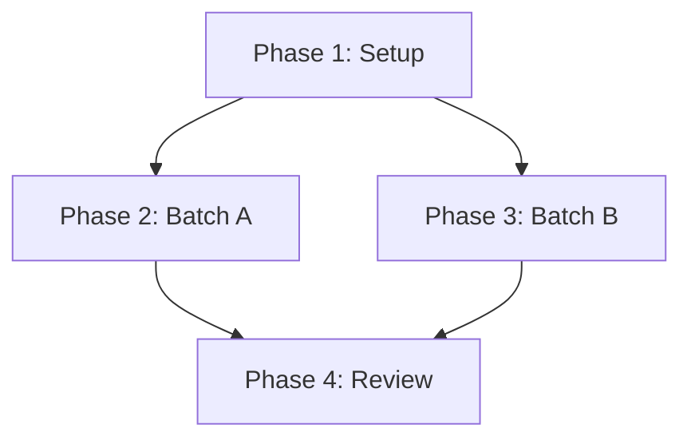

# Implementierungsplan: Rollenmodell für 'Verwaltung V5'

**Datum:** 2026-03-11
**Projekt:** Verwaltung V5
**Status:** Entwurf

## 1. Plan-Übersicht
Dieser Plan beschreibt die schrittweise Erstellung von 8 Rollendefinitionen als Markdown-Dateien im Verzeichnis `rollen/`. Die Umsetzung erfolgt in 4 Phasen, wobei die Inhaltserstellung parallelisiert wird.

- **Gesamtphasen:** 4
- **Beteiligte Agenten:** `coder`, `technical_writer`, `code_reviewer`
- **Geschätzter Aufwand:** Gering

## 2. Abhängigkeitsgraph

## 3. Ausführungsstrategie
| Phase | Bezeichnung | Agent | Modus | Abhängigkeit |
|-------|-------------|-------|-------|--------------|
| 1 | Setup | `coder` | Sequentiell | - |
| 2 | Batch A | `technical_writer` | Parallel | Phase 1 |
| 3 | Batch B | `technical_writer` | Parallel | Phase 1 |
| 4 | Review | `code_reviewer` | Sequentiell | Phase 2, 3 |

## 4. Phasen-Details

### Phase 1: Setup
- **Ziel:** Erstellung der Projektstruktur.
- **Agent:** `coder`
- **Dateien:** 
  - Erstellung Verzeichnis `rollen/`
- **Details:** Sicherstellen, dass das Verzeichnis in der Projektwurzel existiert.
- **Validierung:** `ls -d rollen/`

### Phase 2: Inhalt - Batch A (Parallel)
- **Ziel:** Erstellung der ersten 4 Kernrollen.
- **Agent:** `technical_writer`
- **Dateien:**
  - `rollen/Projektleitung.md`
  - `rollen/Kern-Entwickler.md`
  - `rollen/Qualitätssicherung.md`
  - `rollen/DevOps-Ingenieur.md`
- **Details:** Jede Datei folgt dem Design-Schema (Name, Beschreibung, Aufgaben, Kompetenzen, Schnittstellen) in professionellem Deutsch.
- **Validierung:** Prüfung auf Existenz und Grundstruktur.

### Phase 3: Inhalt - Batch B (Parallel)
- **Ziel:** Erstellung der 4 Spezialistenrollen.
- **Agent:** `technical_writer`
- **Dateien:**
  - `rollen/Technischer-Autor.md`
  - `rollen/Sicherheits-Experte.md`
  - `rollen/Performance-Experte.md`
  - `rollen/Integrations-Lead.md`
- **Details:** Analog zu Batch A, mit Fokus auf die spezifischen technischen Anforderungen (Security, Performance, Integration).
- **Validierung:** Prüfung auf Existenz und Grundstruktur.

### Phase 4: Review
- **Ziel:** Qualitätskontrolle und Finalisierung.
- **Agent:** `code_reviewer`
- **Details:** Prüfung aller 8 Dateien auf sprachliche Konsistenz, korrekte Terminologie und CLI-Fokus.
- **Validierung:** Alle Erfolgskriterien aus dem Design-Dokument sind erfüllt.

## 5. Kostenabschätzung (Token)
| Phase | Agent | Modell | Est. Input | Est. Output | Est. Cost |
|-------|-------|-------|-----------|------------|----------|
| 1 | coder | pro | 1K | 0.5K | $0.03 |
| 2 | tech_writer | pro | 2K | 2K | $0.10 |
| 3 | tech_writer | pro | 2K | 2K | $0.10 |
| 4 | reviewer | pro | 4K | 1K | $0.08 |
| **Total** | | | **9K** | **5.5K** | **~$0.31** |

## 6. Risikoklassifizierung
- **Phase 1:** LOW (Einfache Datei-Operation)
- **Phase 2 & 3:** MEDIUM (Sprachliche Qualität und Konsistenz über 8 Dateien)
- **Phase 4:** LOW (Finaler Check)

## 7. Ausführungsprofil
- **Gesamtphasen:** 4
- **Parallelisierbare Phasen:** 2 (Batch A & B)
- **Sequentielle Phasen:** 2 (Setup & Review)
- **Modus-Empfehlung:** Parallel (für Batch A & B), sonst Sequentiell.
